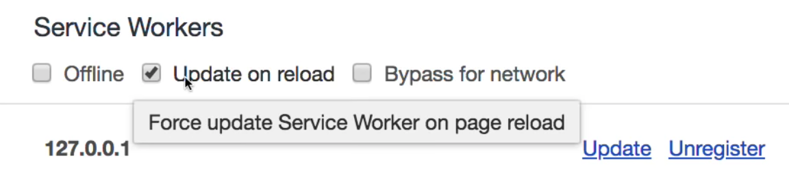

## Make sure sw are supported

### life cycle

- ...
- **activate** - After install, use for cleaning previous cache
- ...

### set cache name

### set cache assets

## Cheats

### Set dev mode

> _Chrome -> devtools -> Application -> Service Workers -> Update on reload_

### sw file in root

use `sw.js` file in root folder for skip scope caveats
